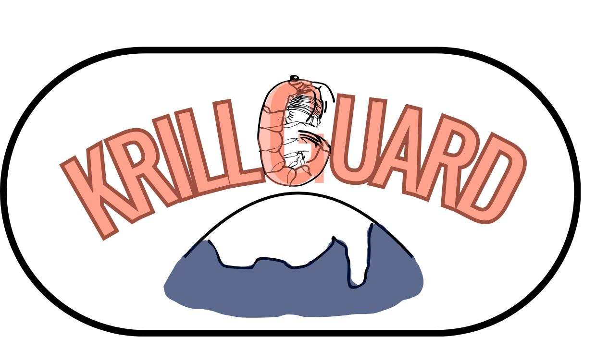

#### Welcome to the KrillGUARD repository! What you can find here:

[KrillGUARD_public.xlsx ](https://github.com/prongselk/krillguard/blob/main/KrillGUARD_public.xlsx) 

This is the most recent version of a database comprising all the krill samples from the IOS Discovery collection, stored in the Natural History Museum. See sheet 1 of the workbook for metadata. 

We also have an app visualising the collection scope, you can access it [here](https://krillguard.streamlit.app/#krill-station-data-discovery-expeditions). The code for the app can be found in [this folder](https://github.com/prongselk/krillguard/tree/main/krillguard_app).

[excel_to_csv_public.ipynb](https://github.com/prongselk/krillguard/blob/main/excel_to_csv_public.ipynb)

This is a Jupyter notebook aimed to help with extracting the sample information from the Excel workbook. Run it in Google Colab to get a neat .csv file that you can analyse. 

[Discovery_station_guide.xlsx](https://github.com/prongselk/krillguard/blob/main/Discovery_station_guide.xlsx)

This is an Excel workbook that can be used as a template for auto-filling Discovery, William Scoresby, William Hervig and Challenger station data. Consult the workbook's readme for more information.

[geodesic_calculations.ipynb](https://github.com/prongselk/krillguard/blob/main/geodesic_calculations.ipynb)

This code can be used to transform station localities from text descriptions to coordinates.

